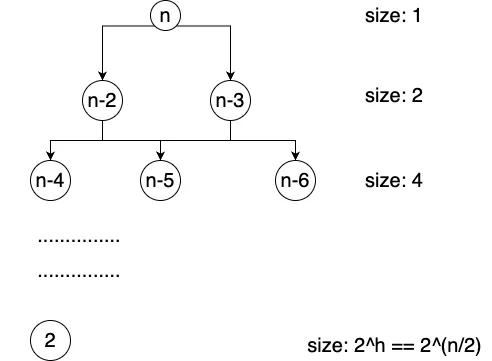

## Table of contents

## Context

This seems to be a popular question.
It is on LeetCode and has been reported seen in interviews in multiple companies.
You can check the tags at the bottom of the page or check all the [tags](../../tags/) of this site.

## Hackerrank Question Description

Many simple encoding methods have been devised over the years. A common method is the ASClI character set used to display characters on the screen. Each character is given a numeric value which can be interpreted by the computer.

To decode the string, first reverse the string of digits, then successively pick valid values from the string and convert them to their ASCIl equivalents. Some values will have two digits, and others three.

Use the ranges of valid values when decoding the string of digits.
For reference, the characters in `s` correspond to the following ASCIl values:

- The value range for A through Z is 65 through 90.
- The value range for a through z is 97 through 122.
- The value of the space character is 32.

Given a string, decode it following the steps mentioned above.

Example

The table below shows the conversion from the string "HackerRank" to the ASCII string `7297991071011148297110107`:


| Character | H  | a  | c  | k   | e   | r   | R  | a  | n   | k   |
|-----------|----|----|----|-----|-----|-----|----|----|-----|-----|
| Ascii     | 72 | 97 | 99 | 107 | 101 | 114 | 82 | 97 | 110 | 108 |


The last step of the encoding is to reverse the ASCII string: `7010117928411101701997927`.

To decode the string, first reverse the string of digits, then successively pick valid values from the string and convert them to their ASCIl equivalents. Some values will have two digits, and others three. Use the ranges of valid values when decoding the string of digits. For reference, the characters in s correspond to the following ASCII values:

- The value range for A through Z is 65 through 90.
- The value range for a through z is 97 through 122.
- The value of the space character is 32.

Function Description

Complete the function `decode` in the editor below.

```
decode has the following parameters:
    string encoded: an encoded string
Returns:
    string: the original decoded string
```

Constraints

- $1 \leq |s| \leq 10^5$
- `s[i]` is an ascii character in the range `[A-Za-z]` or a space character

Sample Case 0

```java
String s = '23511011501782351112179911801562340161171141148'

// expected output
String res = "Truth Always Wins "
```

## Solution

### Idea

The thought process is straight forward.

The digits in the code can start with `3-9` or `1`. We decode it back for these two cases and done.

Complexity: Time $O(n)$, Space $O(1)$ not considering result space.

####  Python

```python
def decode_ascii_string(s: str) -> str:
    s, i, res = s[::-1], 0, []

    def convert(s: str) -> str:
        return chr(int(s))

    while i < len(s):
        if '3' <= s[i] <= '9':
            res.append(convert(s[i:i + 2]))
            i += 2
        else:
            res.append(convert(s[i:i + 3]))
            i += 3
    return ''.join(res)


def encode_ascii_string(s: str) -> str:
    return ''.join(map(str, map(ord, s)))[::-1]
```

Unit Test

```python
cases = [
    ('hello world', '00180141111191123111801801101401'),
    ('HackerRank', '7010117928411101701997927'),
    ('Go VMWare', '101411797877682311117'),
    ('Truth Always Wins ', '23511011501782351112179911801562340161171141148')
]

class TestAsciiEncodedString(TestCase):

    def test_encoder(self):
        for s, exp in cases:
            with self.subTest(s=s):
                self.assertEqual(exp, encode_ascii_string(s))

    def test_decoder(self):
        for s, exp in cases:
            with self.subTest(s=s):
                self.assertEqual(s, decode_ascii_string(exp))
```

## LeetCode 91 Decode Ways

You have intercepted a secret message encoded as a string of numbers.
The message is **decoded** via the following mapping:

`"1" -> 'A'   "2" -> 'B'   ...   "25" -> 'Y'   "26" -> 'Z'`

However, while decoding the message, you realize
that there are many different ways you can decode the message because some codes are contained in other codes
(`"2"` and `"5"` vs `"25"`).

For example, `"11106"` can be decoded into:

-   `"AAJF"` with the grouping `(1, 1, 10, 6)`
-   `"KJF"` with the grouping `(11, 10, 6)`
-   The grouping `(1, 11, 06)` is invalid because `"06"` is not a valid code (only `"6"` is valid).

Note: there may be strings that are impossible to decode.

Given a string s containing only digits, return the **number of ways** to **decode** it. If the entire string cannot be decoded in any valid way, return `0`.

The test cases are generated so that the answer fits in a **32-bit** integer.

```
Example 1:

Input: s = "12"

Output: 2

Explanation:

"12" could be decoded as "AB" (1 2) or "L" (12).

Example 2:

Input: s = "226"

Output: 3

Explanation:

"226" could be decoded as "BZ" (2 26), "VF" (22 6), or "BBF" (2 2 6).

Example 3:

Input: s = "06"

Output: 0

Explanation:

"06" cannot be mapped to "F" because of the leading zero ("6" is different from "06"). In this case, the string is not a valid encoding, so return 0.
```

**Constraints:**

-   `1 <= s.length <= 100`
-   `s` contains only digits and may contain leading zero(s).

## Solution

### Idea1

We can solve the question recursively. We can iterate through each character of the string.

1. Each iteration, there are two possibilities.
   1. We decode one character and decode.
   2. Or We can decode two characters if it is valid.
2. After that, we decode the remaining of the string and sum up the possibilities.

Complexity: Time $O(2^\dfrac{n}{2})$, Space $O(n)$.
The time complexity can be analyzed with the recursion tree method.
Check the analysis for the VMWare question [below](./#idea1-1).

This idea will run time limit exceeded on LeetCode.

#### Python

```python
class Solution2:
   """TLE"""

   def numDecodings(self, s: str) -> int:

      def dfs(i):
         n = len(s)
         if i == n: return 1
         if s[i] == '0': return 0
         res = dfs(i + 1)  # take one character
         if i < n - 1 and (s[i] == '1' or s[i] == '2' and s[i + 1] < '7'):
            # take two characters
            res += dfs(i + 2)
         return res

      return dfs(0)
```

### Idea2

We can use memoization and remember the results for the recursive calls of `dfs`.

Let's take it one step further and solve this iteratively. We can use an array for memoization.

Here, `dp[i]` represents the number of ways for substring `s[i:]`.

We have the base case of `dp[n] = 1`, where `n == len(s)`, because there is only one way to decode an empty string.

The recurrence relationship will give us:

```python
dp[i] = (dp[i+1]  # decode s[i], one single character, and then the remaining
        + dp[i+2])  # decode s[i:i+2], two characters, and then the remaining
```

When decoding two characters, we need to validate that it is in the range of `[1,26]`.

Complexity: Time $O(n)$, Space $O(n)$.

#### Python

```python
class Solution1:
    """0 ms, 17.20 mb"""

    def numDecodings(self, s: str) -> int:
        n = len(s)
        dp = [0] * (n + 1)
        dp[n] = 1
        for i in range(n - 1, -1, -1):
            if s[i] == '0': continue
            dp[i] = dp[i + 1]
            if i < n - 1 and (s[i] == '1' or (s[i] == '2' and s[i + 1] < '7')):
                dp[i] += dp[i + 2]
        return dp[0]
```

### Idea3

We notice in the recurrence relationship, we need two prior states to calculate `dp[i]`.

We can improve the space complexity by using two variables instead of an array.

Complexity: Time $O(n)$, Space $O(1)$.

#### Python

```python
class Solution:
   """0 ms, 17.2 mb"""

   def numDecodings(self, s: str) -> int:
      dp1, dp2, n = 1, 0, len(s)  # init dp1 as dp[n]
      for i in range(n - 1, -1, -1):
         dp = 0 if s[i] == '0' else dp1
         if i < n - 1 and (s[i] == '1' or (s[i] == '2' and s[i + 1] < '7')):
            dp += dp2
         dp2 = dp1  # dp[i+2] <- dp[i+1] when i-=1
         dp1 = dp  # dp[i+1] <- dp[i] when i-=1
      return dp1
```

## VMWare Question Description

We encode a string, s, by performing the following sequence of actions:

-   Replace each character with its ASCII value representation.
-   Reverse the string.

For example, the table below shows the conversion from the string "Go VMWare"
to the ASCII string `711113286778797114101`:

|Character |G |o|' ' |V |M |W |a |r |e  |

| Character | G  | o   | ' ' | V  | M  | W  | a  | r   | e   |
|-----------|----|-----|-----|----|----|----|----|-----|-----|
| Ascii     | 71 | 111 | 32  | 86 | 77 | 87 | 97 | 114 | 101 |

ASCII Value 71 111 32 86 77 87 97 114 101

We then reverse the ASCII string to get the encoded string `101411797877682311117`.

For reference, the characters in s are ASCII characters within the range `10 - 126` which include special characters.

The function must decode the encoded string and return the list of ways in which s can be decoded.

The question is found from this [post](https://leetcode.com/discuss/interview-question/algorithms/124549/vmware-decode-all-possibilities-from-a-given-encoded-ascii-string).
It's unclear what is the desired output for the special characters,
so it is better to clarify and see if any special handling is needed.

```java
// encoded - A reversed ASCII string denoting an encoded string s
static Collection<String> decode(String encoded) {
    return Collection<String>
}
```

## Solution

### Idea1

Please refer to [math geometric series knowledge](../cheatsheet-math/#sum-of-a-geometric-series)
to help understand the complexity analysis.

Similar to LeetCode 91, We can solve the question recursively. We can iterate through each character of the string.

1. Each iteration, there are two possibilities.
   1. We take two characters if it is valid.
   2. Or We can take three characters if it is valid.
2. After that, we decode the remaining of the string and sum up the possibilities.

The recursive tree to analyze the time complexity is below.



We sum up all the recursive function calls in all the layers of the recursive tree.
It is a geometric series.
So the time complexity is the sum of that series.

Complexity: Time $O(2^\dfrac{n}{2})$, Space $O(n)$.

In the picture, you can see that some of the function call parameters are the same.
For example, we call `n-5` from both `n-2` and `n-3`.
We can use memoization (a hash map) to remember the result of the recursive function calls.
So we would only need to call each argument once.
The arguments are `n-2`, `n-3`, `n-4`, ..., 2.
This way, we can reduce the time complexity dramatically.

Complexity: Time $O(n)$, Space $O(n)$.

Similarly, we can further reduce the space complexity.

Complexity: Time $O(n)$, Space $O(1)$.

#### Python

```python
def decode_ascii_string_dp(s: str) -> list[str]:
    s, n = s[::-1], len(s)
    dp, dp1, dp2, dp3 = [], [], [''], []  # dp, dp[i+1], dp[i+2], dp[i+3]
    for i in range(n - 2, -1, -1):
        dp = [] if s[i] == '0' else [convert(s[i:i + 2]) + s1 for s1 in dp2]
        if i < n - 2 and '10' <= s[i:i + 2] <= '12' and s[i:i + 3] <= '126':
            dp += [convert(s[i:i + 3]) + s1 for s1 in dp3]
        dp3 = dp2
        dp2 = dp1
        dp1 = dp
    return dp
```

Unit Test

```python
cases2 = [
    ('0102101010231414141456102020111101', ['\n\x0bn\x14\x14\x106\x0e\x0e\x0e\r\x14\n\nx\n',
                                            '\n\x0bn\x14\x14\x106\x0e\x0e\x0e\r\x14\ne\x14\n',
                                            '\no\n\x14\x14\x106\x0e\x0e\x0e\r\x14\n\nx\n',
                                            '\no\n\x14\x14\x106\x0e\x0e\x0e\r\x14\ne\x14\n',
                                            'e\x0b\n\x14\x14\x106\x0e\x0e\x0e\r\x14\n\nx\n',
                                            'e\x0b\n\x14\x14\x106\x0e\x0e\x0e\r\x14\ne\x14\n']),
    ('10111', ['\x0be']),
    ('02101', ['\nx', 'e\x14']),  # \x followed by 2 digit hex value 0x14 == 20
    ('21111', ['\x0bp', 'o\x0c']),
    ('0102101', ['\nx\n', 'e\x14\n']),
]


class TestAsciiEncodedString(TestCase):

   def test_decoder_dp(self):
      for s, exp in cases2:
         with self.subTest(s=s):
            exp.sort()
            res = sorted(decode_ascii_string_dp(s))
            self.assertEqual(exp, res)
```
